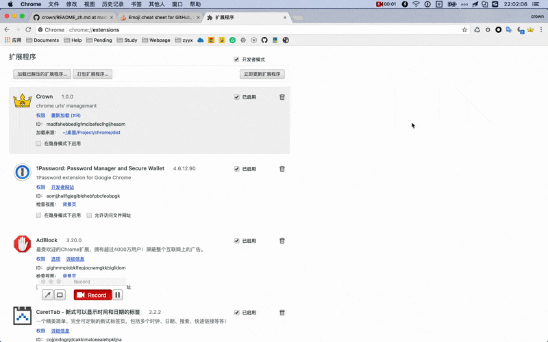

<p align="center">
    
</p>

<h2 align="center">Crown</h2>

A chrome extension to quickly retrieve and switch your bookmarks and tabs!!! :alien: :punch:

[中文文档](./docs/README_zh.md) | [English document](./README.md)

## Download :

<p align="center">
    <a style="margin:0 50px;" href="https://chrome.google.com/webstore/detail/crown/bfmniheobinjpgcoljkfhhalfeambejo?utm_source=chrome-ntp-icon"></a>
    <a href="https://github.com/crown3/crown/releases"></a>
</p>

<h5 align="center">Currently you can download the latest apps from Chrome Web Store and  Github Release</h5>

## Display

<p align="center">
    
</p>

* Default `alt + s` to open this extension , you can find in your `chrome://extensions/` to set it.
* In the input box under the focus to support the following shortcuts
    - `tab`: Toggle bookmark search and tab search
    - `up` & `down`: control the selected item
    - `enter`: jump to the appropriate page

## Build

#### This project is mainly developed using `Vue.js`,` Webpack` for management (based on `vue-cli webpack-simple` template)

```bash
# install dependencies
npm install

# build for production with minification
npm run build
```

> Tips: The files in the `dist` directory generated after the package is the last file we generated. You can add the extension by loading the decompressed extension directly in chrome developer mode or by wrapping it to generate the extension

## License

[MIT](http://opensource.org/licenses/MIT)

## End

The plug-in's `icon` basically come from [Ali Iconfont] (http://www.iconfont.cn/), thanks for these people have been quietly dedicated privately
