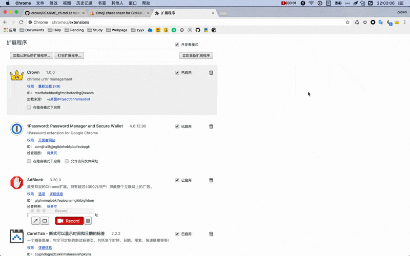

<p align="center">
    
</p>

<h2 align="center">Crown</h2>

一款用来快速检索和切换你的书签和 tabs 的 chrome 扩展程序!!! :alien: :punch:

[中文文档](./README_zh.md) | [English document](./README.md)

## 下载地址 :

<p align="center">
    <a style="margin:0 50px;" href="https://chrome.google.com/webstore/detail/crown/bfmniheobinjpgcoljkfhhalfeambejo?utm_source=chrome-ntp-icon"></a>
    <a href="https://github.com/crown3/crown/releases"></a>
</p>

<h5 align="center">目前你可以分别从 `Chrome Web Store` 和 `Github Release` 上下载最新的应用</h5>

## 功能展示

<p align="center">
    
</p>

* 默认 `ctrl + s` 快捷打开本扩展 , 可在你的[chrome 扩展程序页面](chrome://extensions/) 找到最下面的 `键盘快捷键` 按钮点击进行修改
* 在输入框获得焦点下支持以下快捷操作
	* `tab`: 切换书签搜索和标签页搜索
	* `up` & `down`: 上下方向键来控制选中项
	* `enter`: 回车直接跳转到相应页面

## 如何打包安装

#### 该项目主要使用 `Vue.js` 进行开发 , `Webpack` 进行管理 ( 基于 `vue-cli`的 `webpack-simple` 模板进行的修改 )

```bash
# install dependencies
npm install

# build for production with minification
npm run build
```

> Tips: 打包之后生成的 `dist` 目录下的文件就是我们最后生成的文件 , 你可以直接在 chrome 开发者模式下加载已解压的扩展程序来添加该扩展 , 也可以自行去打包生成扩展程序

## License

[MIT](http://opensource.org/licenses/MIT)

## 最后

该插件的`icon`基本都来自于 [阿里矢量库](http://www.iconfont.cn/) , 谢谢这些一直在私下默默奉献的人们
